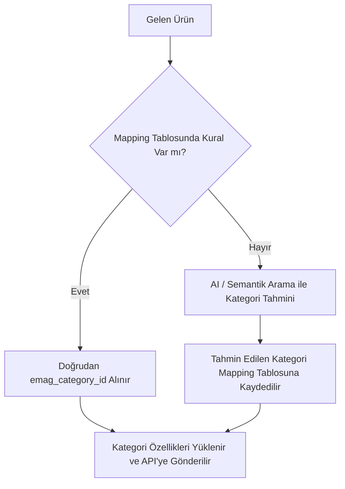

# eMAG Kategori Çekme, Veritabanı Şeması ve Otomatik Kategorilendirme Rehberi

Bu doküman, eMAG Marketplace API üzerinden **tüm kategori ağacını** ve **kategoriye özel karakteristikleri (özellikleri)** çekmek, yerel veritabanında saklamak ve ürünleri otomatik kategorilendirmek için gereken API endpoint'lerini, SQL veritabanı tablolarını ve çalışma mimarisini açıklar.

---

## 1. Kullanılacak eMAG API Endpoint'leri

eMAG API v3'te kategoriler ve özellikler tek bir ana servis (`category/read`) üzerinden yönetilir.

* **API Base URL (Bulgaristan):** `https://marketplace-api.emag.bg`
* **API Base URL (Romanya):** `https://marketplace-api.emag.ro`
* **API Base URL (Macaristan):** `https://marketplace-api.emag.hu`
* **Kimlik Doğrulama:** `HTTP Basic Auth` (`username` ve `password/api-key`)

---

### A. Tüm Kategorileri Sayfalı (Pagination) Çekme

Tüm kategori ağacını ve hiyerarşiyi çekmek için kullanılır.

* **Method:** `POST`
* **URL:** `/api-3/category/read?language=en` *(Diller: `en`, `bg`, `ro`, `hu`)*
* **İstek Gövdesi (Body):**
```json
{
  "currentPage": 1,
  "itemsPerPage": 100
}
```
* **Dönen Örnek Yanıt:**
```json
{
  "isError": false,
  "messages": [],
  "results": [
    {
      "id": 257548,
      "name": "LED Strips & Accessories",
      "parent_id": 14022,
      "is_allowed": 1
    },
    {
      "id": 102441,
      "name": "Smart Switches & Sockets",
      "parent_id": 14022,
      "is_allowed": 1
    }
  ]
}
```

> **Not:** `results` boş dizi dönene kadar `currentPage` 1 artırılarak tüm kategoriler veritabanına aktarılır.

---

### B. Kategoriye Özel Karakteristikleri (Özellikleri) Çekme

Bir kategorinin içine hangi özelliklerin girilebileceğini ve hangilerinin **zorunlu (`is_mandatory: 1`)** olduğunu öğrenmek için `id` parametresi gönderilir.

* **Method:** `POST`
* **URL:** `/api-3/category/read?language=en`
* **İstek Gövdesi (Body):**
```json
{
  "id": 257548,
  "valuesCurrentPage": 1,
  "valuesPerPage": 100
}
```
* **Dönen Örnek Yanıt:**
```json
{
  "isError": false,
  "results": {
    "id": 257548,
    "name": "LED Strips & Accessories",
    "characteristics": [
      {
        "id": 1402,
        "name": "Supply Voltage",
        "is_mandatory": 1,
        "display_type": 2,
        "values": [
          { "id": 101, "name": "5V" },
          { "id": 102, "name": "12V" },
          { "id": 103, "name": "220V" }
        ]
      },
      {
        "id": 2201,
        "name": "Length",
        "is_mandatory": 0,
        "display_type": 1,
        "values": []
      }
    ],
    "family_types": []
  }
}
```

---

## 2. Gerekli Veritabanı Tabloları (SQL Şeması)

Kategorileri ve ürün tipi eşleştirmelerini saklamak için **PostgreSQL / MySQL / SQLite** uyumlu 4 temel tablo:

```sql
-- 1. eMAG Kategorileri Tablosu
CREATE TABLE emag_categories (
    id BIGINT PRIMARY KEY,                 -- eMAG Kategori ID (Örn: 257548)
    name VARCHAR(255) NOT NULL,            -- Kategori Adı (Örn: LED Strips)
    parent_id BIGINT NULL,                 -- Üst Kategori ID (Hiyerarşi için)
    is_allowed BOOLEAN DEFAULT TRUE,       -- Mağazanızın bu kategoride satış izni var mı?
    full_path TEXT NULL,                   -- Hiyerarşik tam yol (Örn: Home > Lighting > LED Strips)
    created_at TIMESTAMP DEFAULT CURRENT_TIMESTAMP,
    updated_at TIMESTAMP DEFAULT CURRENT_TIMESTAMP
);

-- 2. Kategori Özellikleri (Characteristics) Tablosu
CREATE TABLE emag_characteristics (
    id BIGINT PRIMARY KEY,                 -- eMAG Özellik ID (Örn: 1402)
    category_id BIGINT NOT NULL,           -- Hangi kategoriye ait olduğu
    name VARCHAR(255) NOT NULL,            -- Özellik Adı (Örn: Supply Voltage)
    is_mandatory BOOLEAN DEFAULT FALSE,    -- Zorunlu alan mı? (1 ise ürün kaydında şart)
    display_type INT NULL,                 -- Arayüz gösterim tipi (dropdown, text, checkbox)
    created_at TIMESTAMP DEFAULT CURRENT_TIMESTAMP,
    FOREIGN KEY (category_id) REFERENCES emag_categories(id) ON DELETE CASCADE
);

-- 3. Özellik Seçenek Değerleri (Opsiyonel / Predefined Values)
CREATE TABLE emag_characteristic_values (
    id BIGINT PRIMARY KEY,                 -- eMAG Değer ID
    characteristic_id BIGINT NOT NULL,     -- İlgili özellik
    value_name VARCHAR(255) NOT NULL,      -- Değer metni (Örn: 5V, 12V, Red, Blue)
    FOREIGN KEY (characteristic_id) REFERENCES emag_characteristics(id) ON DELETE CASCADE
);

-- 4. Ürün Tipi & Kategori Eşleştirme (Mapping) Tablosu
CREATE TABLE product_category_mappings (
    id SERIAL PRIMARY KEY,
    source_type_or_keyword VARCHAR(255) UNIQUE NOT NULL, -- Sizin sisteminizdeki ürün tipi veya etiket (Örn: "led_strip", "smart_plug")
    emag_category_id BIGINT NOT NULL,                    -- Eşleşen eMAG Kategori ID
    auto_matched_by VARCHAR(50) DEFAULT 'manual',        -- 'ai', 'rule', 'manual'
    confidence_score FLOAT DEFAULT 1.0,                  -- AI eşleme güven skoru (0.0 - 1.0)
    is_verified BOOLEAN DEFAULT TRUE,                    -- Yönetici onayladı mı?
    updated_at TIMESTAMP DEFAULT CURRENT_TIMESTAMP,
    FOREIGN KEY (emag_category_id) REFERENCES emag_categories(id)
);
```

---

## 3. Ürün Tipine Göre Otomatik Kategorilendirme Yöntemi

Ürünleri kategorilendirirken 2 kademeli bir strateji önerilir:



1. **1. Aşama (Hızlı Eşleme / Cache):**
   * Ürününüzün Shopify / ERP tipine veya etiketine bakılır (Örn: `product_type = "LED Strip"`).
   * `product_category_mappings` tablosunda varsa doğrudan `emag_category_id` alınır.

2. **2. Aşama (Yeni Ürünler İçin AI Eşleme):**
   * Eğer veritabanında eşleşme yoksa ürün başlığı + açıklaması AI'ya verilir.
   * `emag_categories` tablosundaki izin verilen (`is_allowed = 1`) yaprak kategoriler arasından en uygun `category_id` seçtirilir.
   * Seçilen sonuç bir sonraki sefer için `product_category_mappings` tablosuna otomatik yazılır.

---

## 4. Örnek Kategori Senkronizasyon Scripti (Node.js)

Tüm eMAG kategorilerini çekip yerel veritabanına yazan örnek senkronizasyon fonksiyonu:

```javascript
import axios from 'axios';

const EMAG_BASE_URL = 'https://marketplace-api.emag.bg/api-3';
const AUTH_HEADER = 'Basic ' + Buffer.from('KULLANICI_ADI:SIFRE_VEYA_KEY').toString('base64');

async function syncAllCategories() {
  let currentPage = 1;
  const itemsPerPage = 100;
  let hasMore = true;

  console.log('eMAG Kategori Senkronizasyonu Başlatıldı...');

  while (hasMore) {
    try {
      const response = await axios.post(
        `${EMAG_BASE_URL}/category/read?language=en`,
        { currentPage, itemsPerPage },
        { headers: { Authorization: AUTH_HEADER, 'Content-Type': 'application/json' } }
      );

      const categories = response.data.results || [];
      if (categories.length === 0) {
        hasMore = false;
        break;
      }

      console.log(`Sayfa ${currentPage}: ${categories.length} kategori alındı.`);

      for (const cat of categories) {
        // Burada veritabanına UPSERT (INSERT OR UPDATE) işlemi yapılır:
        // await db.query('INSERT INTO emag_categories (id, name, parent_id, is_allowed) VALUES ($1, $2, $3, $4) ON CONFLICT (id) DO UPDATE ...', [cat.id, cat.name, cat.parent_id, cat.is_allowed]);
      }

      currentPage++;
    } catch (error) {
      console.error('Kategori çekilirken hata oluştu:', error.message);
      hasMore = false;
    }
  }

  console.log('Tüm kategoriler başarıyla kaydedildi.');
}
```
